# [📈 Live Status](https://uptime.orangepill.dev): <!--live status--> **🟧 Partial outage**

This repository contains the open-source uptime monitor and status page for [Ezofox](https://uptime.orangepill.dev), powered by [Upptime](https://github.com/upptime/upptime).

With [Upptime](https://upptime.js.org), you can get your own unlimited and free uptime monitor and status page, powered entirely by a GitHub repository. We use [Issues](https://github.com/sakhalinfox/orangepilldevuptime/issues) as incident reports, [Actions](https://github.com/sakhalinfox/orangepilldevuptime/actions) as uptime monitors, and [Pages](https://uptime.orangepill.dev) for the status page.

<!--start: status pages-->
<!-- This summary is generated by Upptime (https://github.com/upptime/upptime) -->
<!-- Do not edit this manually, your changes will be overwritten -->
<!-- prettier-ignore -->
| URL | Status | History | Response Time | Uptime |
| --- | ------ | ------- | ------------- | ------ |
|  [Nostr relay websocket connectivity check - wss://nostr.orangepill.dev](wss://nostr.orangepill.dev) | 🟩 Up | [nostr-relay-websocket-connectivity-check-wss-nostr-orangepill-dev.yml](https://github.com/Sakhalinfox/orangepilldevuptime/commits/HEAD/history/nostr-relay-websocket-connectivity-check-wss-nostr-orangepill-dev.yml) | 

 0ms
     
 | 

<a href="https://uptime.orangepill.dev/history/nostr-relay-websocket-connectivity-check-wss-nostr-orangepill-dev">100.00%</a>
    

|  [Nost Public Relay Response time - wss://nostr.orangepill.dev](https://nostr.orangepill.dev) | 🟥 Down | [nost-public-relay-response-time-wss-nostr-orangepill-dev.yml](https://github.com/Sakhalinfox/orangepilldevuptime/commits/HEAD/history/nost-public-relay-response-time-wss-nostr-orangepill-dev.yml) | 

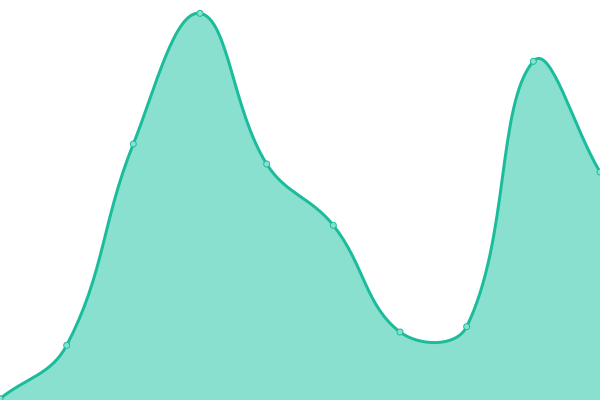 338ms
     
 | 

<a href="https://uptime.orangepill.dev/history/nost-public-relay-response-time-wss-nostr-orangepill-dev">100.00%</a>
    

|  [Nostr Relay - wss://relay.valera.co](wss://relay.valera.co) | 🟩 Up | [nostr-relay-wss-relay-valera-co.yml](https://github.com/Sakhalinfox/orangepilldevuptime/commits/HEAD/history/nostr-relay-wss-relay-valera-co.yml) | 

 0ms
     
 | 

<a href="https://uptime.orangepill.dev/history/nostr-relay-wss-relay-valera-co">100.00%</a>
    

|  [Nostr Relay - wss://nostrical.com](https://nostrical.com) | 🟥 Down | [nostr-relay-wss-nostrical-com.yml](https://github.com/Sakhalinfox/orangepilldevuptime/commits/HEAD/history/nostr-relay-wss-nostrical-com.yml) | 

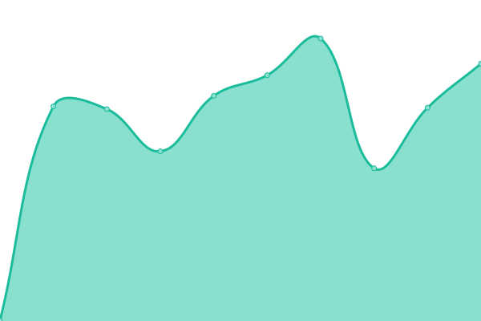 0ms
     
 | 

<a href="https://uptime.orangepill.dev/history/nostr-relay-wss-nostrical-com">0.00%</a>
    

|  [Nostr Relay - wss://no.str.cr](https://no.str.cr) | 🟥 Down | [nostr-relay-wss-no-str-cr.yml](https://github.com/Sakhalinfox/orangepilldevuptime/commits/HEAD/history/nostr-relay-wss-no-str-cr.yml) | 

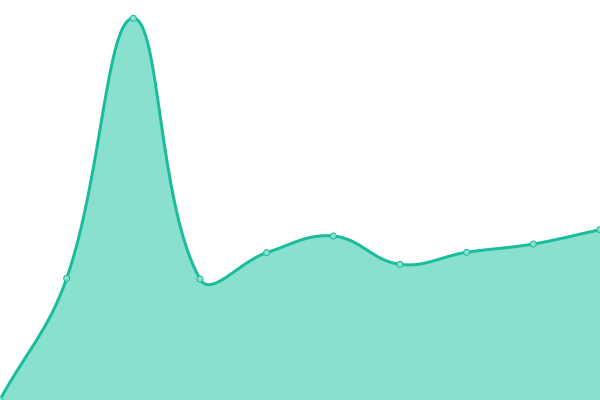 497ms
     
 | 

<a href="https://uptime.orangepill.dev/history/nostr-relay-wss-no-str-cr">70.97%</a>
    

|  [Nostr Relay - wss://paid.no.str.cr](https://paid.no.str.cr) | 🟩 Up | [nostr-relay-wss-paid-no-str-cr.yml](https://github.com/Sakhalinfox/orangepilldevuptime/commits/HEAD/history/nostr-relay-wss-paid-no-str-cr.yml) | 

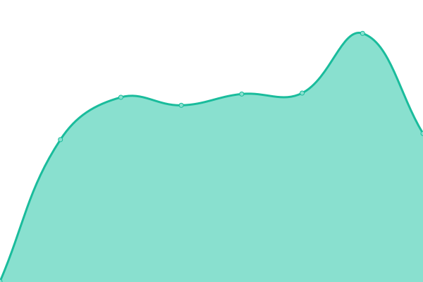 434ms
     
 | 

<a href="https://uptime.orangepill.dev/history/nostr-relay-wss-paid-no-str-cr">100.00%</a>
    

|  [Nostr Relay - wss://nostr.fly.dev](https://nostr.fly.dev) | 🟥 Down | [nostr-relay-wss-nostr-fly-dev.yml](https://github.com/Sakhalinfox/orangepilldevuptime/commits/HEAD/history/nostr-relay-wss-nostr-fly-dev.yml) | 

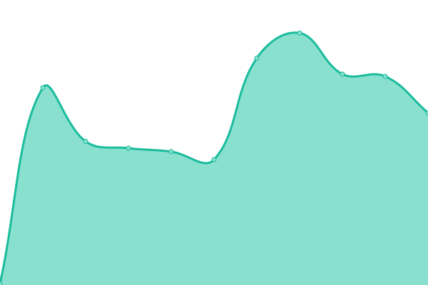 0ms
     
 | 

<a href="https://uptime.orangepill.dev/history/nostr-relay-wss-nostr-fly-dev">0.00%</a>
    

|  [Nostr Relay - wss://public.nostr.swissrouting.com](https://public.nostr.swissrouting.com) | 🟥 Down | [nostr-relay-wss-public-nostr-swissrouting-com.yml](https://github.com/Sakhalinfox/orangepilldevuptime/commits/HEAD/history/nostr-relay-wss-public-nostr-swissrouting-com.yml) | 

 0ms
     
 | 

<a href="https://uptime.orangepill.dev/history/nostr-relay-wss-public-nostr-swissrouting-com">0.00%</a>
    

|  [Nostr Relay - wss://nostr.swiss-enigma.ch](https://nostr.swiss-enigma.ch) | 🟩 Up | [nostr-relay-wss-nostr-swiss-enigma-ch.yml](https://github.com/Sakhalinfox/orangepilldevuptime/commits/HEAD/history/nostr-relay-wss-nostr-swiss-enigma-ch.yml) | 

 1048ms
     
 | 

<a href="https://uptime.orangepill.dev/history/nostr-relay-wss-nostr-swiss-enigma-ch">86.31%</a>
    

|  [Nostr Relay - wss://nostr.chaker.net](https://nostr.chaker.net) | 🟥 Down | [nostr-relay-wss-nostr-chaker-net.yml](https://github.com/Sakhalinfox/orangepilldevuptime/commits/HEAD/history/nostr-relay-wss-nostr-chaker-net.yml) | 

 0ms
     
 | 

<a href="https://uptime.orangepill.dev/history/nostr-relay-wss-nostr-chaker-net">0.00%</a>
    

|  [Nostr Relay - wss://nostr.thesimplekid.com](https://nostr.thesimplekid.com) | 🟥 Down | [nostr-relay-wss-nostr-thesimplekid-com.yml](https://github.com/Sakhalinfox/orangepilldevuptime/commits/HEAD/history/nostr-relay-wss-nostr-thesimplekid-com.yml) | 

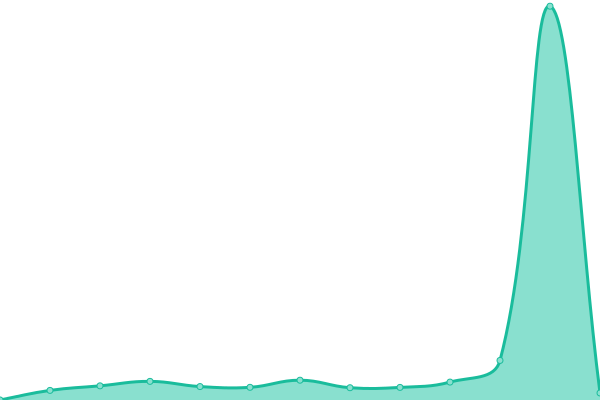 0ms
     
 | 

<a href="https://uptime.orangepill.dev/history/nostr-relay-wss-nostr-thesimplekid-com">0.00%</a>
    

|  [Nostr Relay - wss://knostr.neutrine.com](https://knostr.neutrine.com) | 🟥 Down | [nostr-relay-wss-knostr-neutrine-com.yml](https://github.com/Sakhalinfox/orangepilldevuptime/commits/HEAD/history/nostr-relay-wss-knostr-neutrine-com.yml) | 

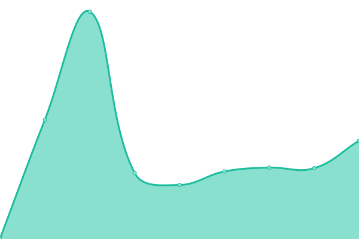 746ms
     
 | 

<a href="https://uptime.orangepill.dev/history/nostr-relay-wss-knostr-neutrine-com">92.66%</a>
    

|  [Nostr Relay - wss://relay.damus.io](https://relay.damus.io) | 🟩 Up | [nostr-relay-wss-relay-damus-io.yml](https://github.com/Sakhalinfox/orangepilldevuptime/commits/HEAD/history/nostr-relay-wss-relay-damus-io.yml) | 

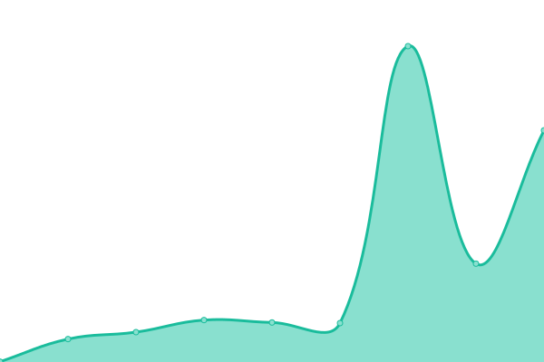 183ms
     
 | 

<a href="https://uptime.orangepill.dev/history/nostr-relay-wss-relay-damus-io">100.00%</a>
    

|  [Nostr Relay - wss://nostr-relay.wlvs.space](https://nostr-relay.wlvs.space) | 🟥 Down | [nostr-relay-wss-nostr-relay-wlvs-space.yml](https://github.com/Sakhalinfox/orangepilldevuptime/commits/HEAD/history/nostr-relay-wss-nostr-relay-wlvs-space.yml) | 

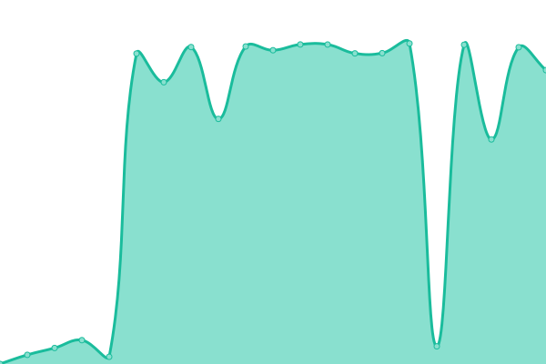 0ms
     
 | 

<a href="https://uptime.orangepill.dev/history/nostr-relay-wss-nostr-relay-wlvs-space">0.00%</a>
    

|  [Nostr Relay - wss://nostr-pub.wellorder.net](https://nostr-pub.wellorder.net) | 🟩 Up | [nostr-relay-wss-nostr-pub-wellorder-net.yml](https://github.com/Sakhalinfox/orangepilldevuptime/commits/HEAD/history/nostr-relay-wss-nostr-pub-wellorder-net.yml) | 

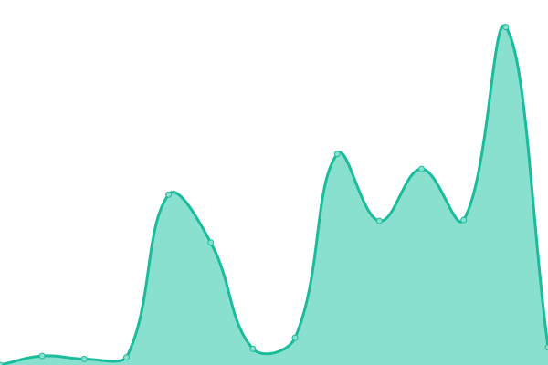 499ms
     
 | 

<a href="https://uptime.orangepill.dev/history/nostr-relay-wss-nostr-pub-wellorder-net">100.00%</a>
    

|  [Nostr Relay - wss://nostr.bitcoiner.social](https://nostr.bitcoiner.social) | 🟩 Up | [nostr-relay-wss-nostr-bitcoiner-social.yml](https://github.com/Sakhalinfox/orangepilldevuptime/commits/HEAD/history/nostr-relay-wss-nostr-bitcoiner-social.yml) | 

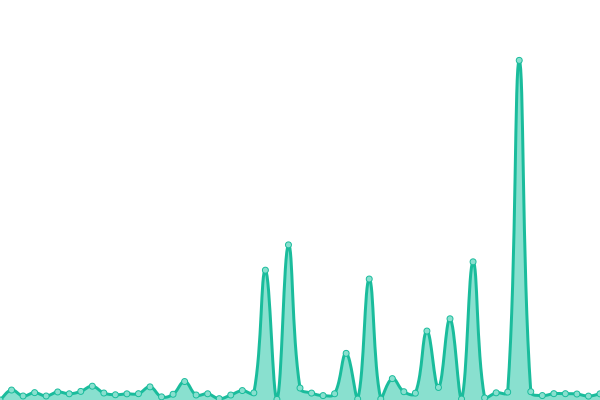 617ms
     
 | 

<a href="https://uptime.orangepill.dev/history/nostr-relay-wss-nostr-bitcoiner-social">100.00%</a>
    

|  [Nostr Relay - wss://nostr.onsats.org](https://nostr.onsats.org) | 🟥 Down | [nostr-relay-wss-nostr-onsats-org.yml](https://github.com/Sakhalinfox/orangepilldevuptime/commits/HEAD/history/nostr-relay-wss-nostr-onsats-org.yml) | 

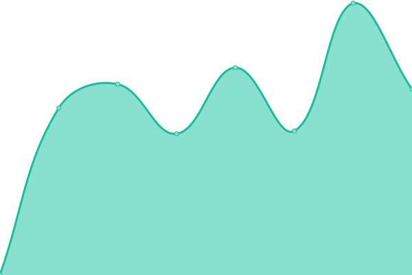 682ms
     
 | 

<a href="https://uptime.orangepill.dev/history/nostr-relay-wss-nostr-onsats-org">0.00%</a>
    

|  [Nostr Relay - wss://nostr.zebedee.cloud](https://nostr.zebedee.cloud) | 🟥 Down | [nostr-relay-wss-nostr-zebedee-cloud.yml](https://github.com/Sakhalinfox/orangepilldevuptime/commits/HEAD/history/nostr-relay-wss-nostr-zebedee-cloud.yml) | 

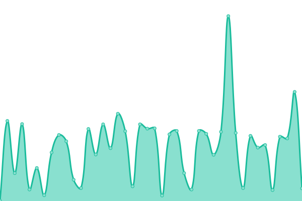 0ms
     
 | 

<a href="https://uptime.orangepill.dev/history/nostr-relay-wss-nostr-zebedee-cloud">0.00%</a>
    

|  [Nostr Relay - wss://relay.nostr.info](https://relay.nostr.info) | 🟥 Down | [nostr-relay-wss-relay-nostr-info.yml](https://github.com/Sakhalinfox/orangepilldevuptime/commits/HEAD/history/nostr-relay-wss-relay-nostr-info.yml) | 

 463ms
     
 | 

<a href="https://uptime.orangepill.dev/history/nostr-relay-wss-relay-nostr-info">0.00%</a>
    

|  [Nostr Relay - wss://nostr-pub.semisol.dev](https://nostr-pub.semisol.dev) | 🟥 Down | [nostr-relay-wss-nostr-pub-semisol-dev.yml](https://github.com/Sakhalinfox/orangepilldevuptime/commits/HEAD/history/nostr-relay-wss-nostr-pub-semisol-dev.yml) | 

 0ms
     
 | 

<a href="https://uptime.orangepill.dev/history/nostr-relay-wss-nostr-pub-semisol-dev">0.00%</a>
    

|  [Nostr Relay - wss://nostr.oxtr.dev](https://nostr.oxtr.dev) | 🟩 Up | [nostr-relay-wss-nostr-oxtr-dev.yml](https://github.com/Sakhalinfox/orangepilldevuptime/commits/HEAD/history/nostr-relay-wss-nostr-oxtr-dev.yml) | 

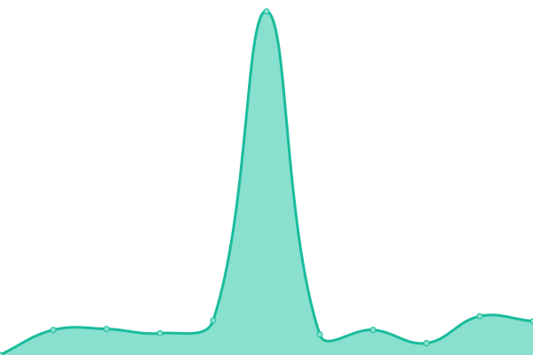 734ms
     
 | 

<a href="https://uptime.orangepill.dev/history/nostr-relay-wss-nostr-oxtr-dev">57.40%</a>
    

|  [Nostr Relay - wss://nostr.fmt.wiz.biz](https://nostr.fmt.wiz.biz) | 🟥 Down | [nostr-relay-wss-nostr-fmt-wiz-biz.yml](https://github.com/Sakhalinfox/orangepilldevuptime/commits/HEAD/history/nostr-relay-wss-nostr-fmt-wiz-biz.yml) | 

 202ms
     
 | 

<a href="https://uptime.orangepill.dev/history/nostr-relay-wss-nostr-fmt-wiz-biz">98.73%</a>
    

|  [Nostr Relay - wss://nostr.walletofsatoshi.com](https://nostr.walletofsatoshi.com) | 🟥 Down | [nostr-relay-wss-nostr-walletofsatoshi-com.yml](https://github.com/Sakhalinfox/orangepilldevuptime/commits/HEAD/history/nostr-relay-wss-nostr-walletofsatoshi-com.yml) | 

 0ms
     
 | 

<a href="https://uptime.orangepill.dev/history/nostr-relay-wss-nostr-walletofsatoshi-com">0.00%</a>
    

|  [Nostr Relay - wss://brb.io](https://brb.io) | 🟥 Down | [nostr-relay-wss-brb-io.yml](https://github.com/Sakhalinfox/orangepilldevuptime/commits/HEAD/history/nostr-relay-wss-brb-io.yml) | 

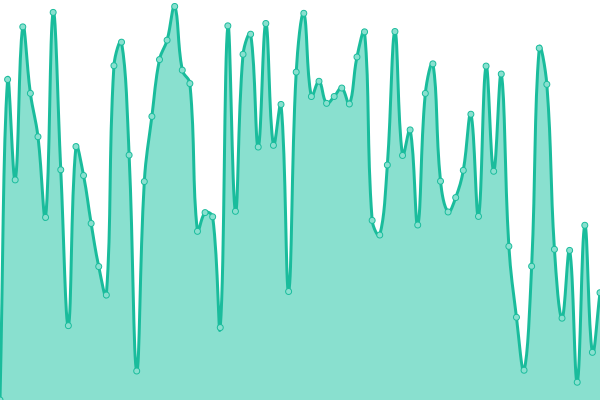 2711ms
     
 | 

<a href="https://uptime.orangepill.dev/history/nostr-relay-wss-brb-io">0.00%</a>
    

|  [Nostr Relay - wss://nostr-relay.untethr.me](https://nostr-relay.untethr.me) | 🟥 Down | [nostr-relay-wss-nostr-relay-untethr-me.yml](https://github.com/Sakhalinfox/orangepilldevuptime/commits/HEAD/history/nostr-relay-wss-nostr-relay-untethr-me.yml) | 

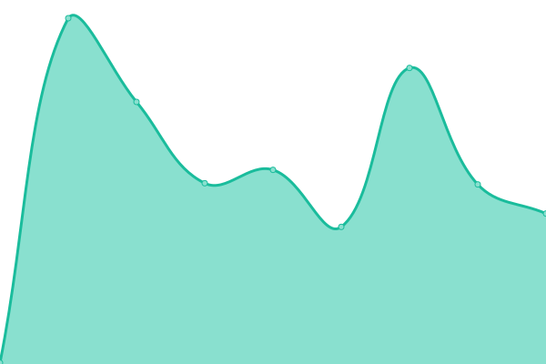 0ms
     
 | 

<a href="https://uptime.orangepill.dev/history/nostr-relay-wss-nostr-relay-untethr-me">0.00%</a>
    

|  [Nostr Relay - wss://relay.nostr.scot](https://relay.nostr.scot) | 🟥 Down | [nostr-relay-wss-relay-nostr-scot.yml](https://github.com/Sakhalinfox/orangepilldevuptime/commits/HEAD/history/nostr-relay-wss-relay-nostr-scot.yml) | 

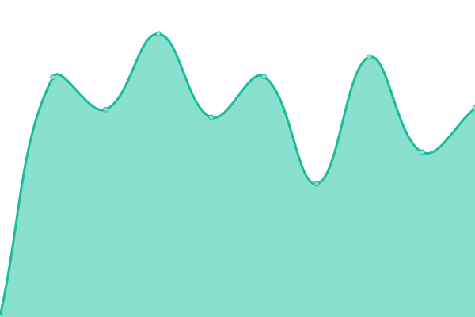 0ms
     
 | 

<a href="https://uptime.orangepill.dev/history/nostr-relay-wss-relay-nostr-scot">0.00%</a>
    

|  [Nostr Relay - wss://relay.nostr.bingo](https://relay.nostr.bingo) | 🟥 Down | [nostr-relay-wss-relay-nostr-bingo.yml](https://github.com/Sakhalinfox/orangepilldevuptime/commits/HEAD/history/nostr-relay-wss-relay-nostr-bingo.yml) | 

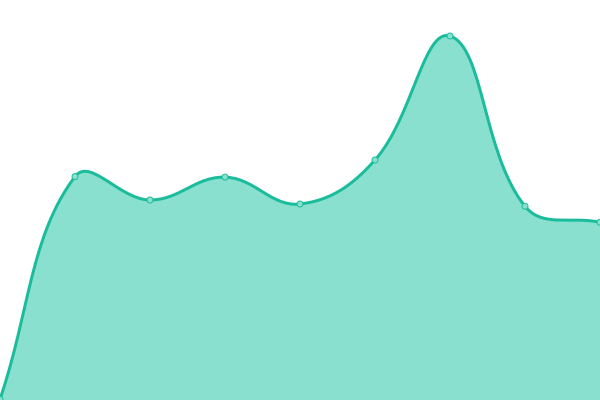 0ms
     
 | 

<a href="https://uptime.orangepill.dev/history/nostr-relay-wss-relay-nostr-bingo">0.00%</a>
    

|  [Nostr Relay - wss://lightningrelay.com](https://lightningrelay.com) | 🟩 Up | [nostr-relay-wss-lightningrelay-com.yml](https://github.com/Sakhalinfox/orangepilldevuptime/commits/HEAD/history/nostr-relay-wss-lightningrelay-com.yml) | 

 276ms
     
 | 

<a href="https://uptime.orangepill.dev/history/nostr-relay-wss-lightningrelay-com">100.00%</a>
    

<!--end: status pages-->

[**Visit our status website →**](https://uptime.orangepill.dev)

## 📄 License

- Powered by: [Upptime](https://github.com/upptime/upptime)
- Code: [MIT](./LICENSE) © [Ezofox](https://uptime.orangepill.dev)
- Data in the `./history` directory: [Open Database License](https://opendatacommons.org/licenses/odbl/1-0/)
